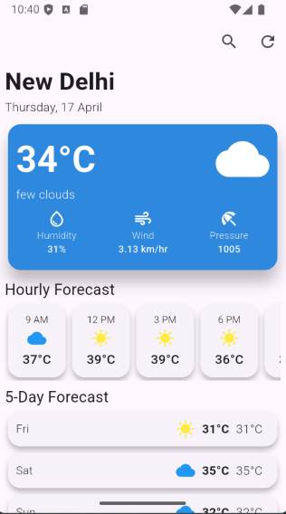

# Weather App

## Overview
This is a 'Weather app' build in Flutter framework,
displays current weather, hourly forecasts, humidity, wind speed, pressure and 5 day forecast.

I have integreated [Open Weather](https://openweathermap.org/) API to get real time data of the location.

## Getting Started
### Prerequisites
Ensure you have the following installed:
- [Flutter SDK](https://flutter.dev/docs/get-started/install)
- [Dart SDK](https://dart.dev/get-dart)
- Android Studio or Visual Studio Code
- Xcode (for iOS development)

### Installation
1. Clone the repository:
   ```sh
   git clone https://github.com/vedantvisoliya/weather_app2.git
   cd weather_app
   ```
2. Install dependencies:
   ```sh
   flutter pub get
   ```
3. Run the project:
   ```sh
   flutter run
   ```
   
## Contribution
Contributions are welcome! Please open an issue or submit a pull request.

## Screenshots

